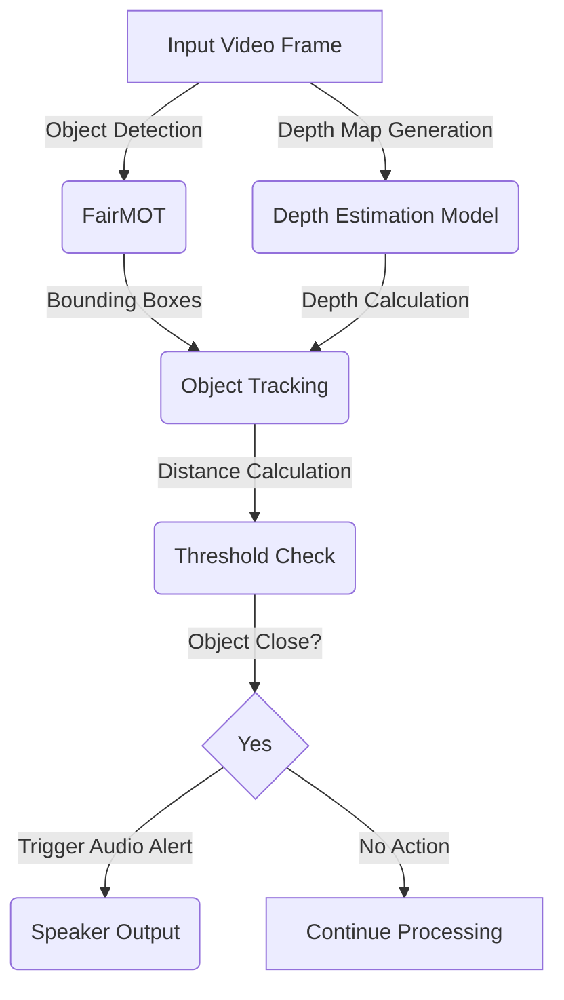

# Smart Assistance System for the Blind using FairMOT and Depth Estimation

## 📌 Overview
The **Smart Assistance System for the Blind** is an AI-powered assistive technology designed to help visually impaired individuals navigate safely by detecting obstacles and providing real-time alerts. The system integrates **FairMOT** for multi-object tracking and **depth estimation** for object distance calculation.

---

## 🚀 Features
✅ **Multi-Object Tracking (MOT)** – Detects and tracks multiple objects in real-time.  
✅ **Object Re-Identification** – Identifies the same object across different video frames.  
✅ **Depth Estimation** – Calculates the distance of detected objects from the camera.  
✅ **Voice Alerts** – Notifies the user if objects are too close.  

---


## 🏗 System Architecture


## 🛠 Technologies Used
- Programming Language: Python 3.8
- Deep Learning Frameworks: PyTorch, TensorFlow
- Computer Vision Libraries: OpenCV
- Hardware: NVIDIA CUDA-enabled GPU (for faster inference)

## 🔬 Models Used

1️⃣ FairMOT (Multi-Object Tracking)
- Backbone: ResNet-34 with Deep Layer Aggregation (DLA-34)
- Detection: CenterNet-based detection framework
- Re-ID Branch: 128-dimensional feature embeddings

2️⃣ Monocular Depth Estimation
- Encoder: DenseNet-169 pre-trained on ImageNet
- Decoder: Upsampling with skip connections
- Dataset: Trained on NYU Depth v2 dataset

## 📊 Dataset Details  
| **Dataset Name**    | **Purpose**                  | **Size** | **Number of Samples** | **Source** |  
|---------------------|-----------------------------|----------|----------------------|------------|  
| **CrowdHuman**      | Object detection & tracking | 15GB+    | 15K+ images         | [CrowdHuman](https://www.crowdhuman.org) |  
| **NYU Depth v2**    | Depth estimation            | 30GB+    | 120K+ samples       | [NYU Depth v2](https://cs.nyu.edu/~silberman/datasets/nyu_depth_v2.html) |  

---

## ⚙ Installation & Usage
1️⃣ Setup Google Drive (if using Google Colab)
```
from google.colab import import drive
drive.mount('/content/gdrive')
```
2️⃣ Clone the Repository
```
git clone https://github.com/sananm/MajorProject
cd MajorProject
```
3️⃣ Install Dependencies
```
pip install -r requirements.txt
```
4️⃣ Install PyTorch (CUDA Enabled)
```
pip install torch==1.7.1+cu110 torchvision==0.8.2+cu110 torchaudio==0.7.2 -f https://download.pytorch.org/whl/torch_stable.html
```
5️⃣ Clone and Compile DCNv2 (Required for FairMOT)
```
git clone -b pytorch_1.7 https://github.com/ifzhang/DCNv2.git
cd DCNv2
./make.sh
cd ..
```
6️⃣ Run the Model on a Test Video
```
python src/demo.py mot --arch resdcn_34 --load_model /content/gdrive/MyDrive/model_50.pth --conf_thres 0.4 --input-video /content/MajorProject/videos/test.mp4
```
## 📈 Results & Performance  
| **Metric**                  | **Description**                          | **Value** |  
|-----------------------------|------------------------------------------|----------|  
| **Object Detection Accuracy** | Measures how accurately objects are detected | **92.5%** |  
| **Tracking Accuracy (MOTA)**  | Multiple Object Tracking Accuracy       | **87.2%** |  
| **Depth Estimation RMSE**     | Root Mean Square Error in depth prediction | **0.45m** |  
| **Inference Speed**           | Time taken per frame during inference | **~60ms/frame** |  

---

## ⚡ Challenges Faced
- Data Diversity: Improving model generalization for different environments.
- Real-Time Processing: Optimizing latency for real-time tracking.
- Depth Estimation Accuracy: Handling varying lighting conditions.

## 🔮 Future Enhancements
- 📱 Mobile App Integration – Develop an Android/iOS application.
- 🎙 Voice Assistant Support – Implement AI-powered speech feedback.
- 🔍 LiDAR Integration – Improve depth accuracy with additional sensors.

## 📜 References
- Zhang, Y. et al., "FairMOT: On the Fairness of Detection and Re-Identification in Multiple Object Tracking", IJCV, 2021.
- Alhashim, I., Wonka, P., "High-Quality Monocular Depth Estimation via Transfer Learning", arXiv, 2018.

## 🤝 Contributors
### 👤 Mohammed Sanan Moinuddin
### 👤 Ananya Vudumula

## 📚 Supervisor
### Dr. M. Swamy Das (CBIT)

## 📝 License
This project is licensed under the MIT License - see the LICENSE file for details.


